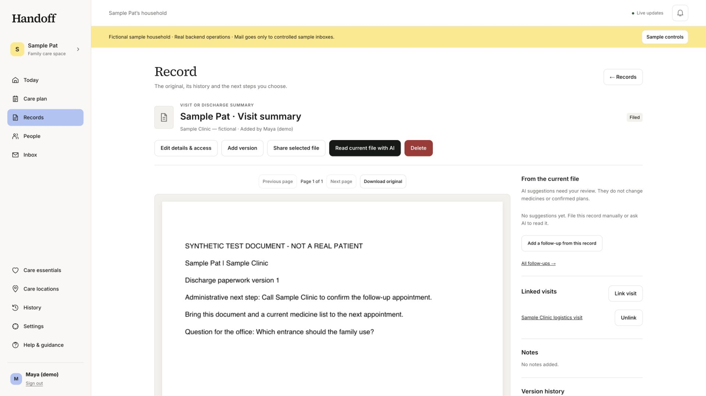
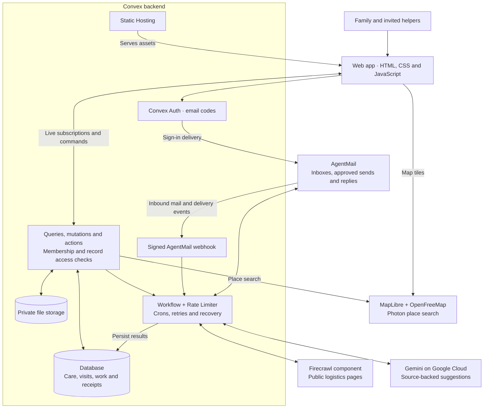

# Handoff

**A shared care workspace for families looking after an aging parent.**

Keep the original paperwork, the next appointment, the ride home and the person responsible in one place. Work changes hands when someone accepts it. A reply brings new information; a person decides when the follow-up is finished.

[Open Handoff](https://admired-fish-176.convex.site) · [Explore a sample family](https://admired-fish-176.convex.site/demo) · [Walkthrough](https://github.com/Satianurag/handoff/releases/download/submission-preview/handoff-walkthrough.mp4) · [Hackathon build log](hackathon.md)



## Why we built it

Family care gets scattered across messages, appointment letters and promises to “handle it.” A shared task list can record the promise, but it rarely connects the source, the next visit, the return ride and whether another person actually agreed to take over.

Handoff connects those steps. Someone uploads an appointment letter, reviews the suggested next steps, prepares questions, asks a sibling to drive, and keeps the clinic’s reply attached to the unresolved question. The family can see what is known, what changed and who has accepted the next responsibility.

## What you can do

- **Keep the original.** Store private PDFs and images with version history, page references and separately controlled access. Review AI suggestions alongside their evidence before adding next steps.
- **Prepare the whole visit.** Collect questions and a printable visit pack. Track the outbound ride, accompanying person and return journey as separate commitments.
- **Hand over explicitly.** Offer responsibilities, accept some or all, and retain an immutable receipt. Later changes remain visible; sending a handover does not transfer ownership by itself.
- **Follow through on replies.** Receive paperwork, approve an outgoing question and connect the reply to its visit or waiting item. New information does not automatically close the item.
- **Coordinate the people and places.** Share live responsibilities, recurring work and coverage. Give helpers limited access; save destinations with entrance, parking and accessibility notes on a map.

This is a browser-based web app. The public evaluation uses fictional care information. AI helps organize information; it does not diagnose, prescribe or change a confirmed care plan.

## Architecture



Provider calls run in server actions. Their results return through mutations, and Convex subscriptions update the connected screens. Originals remain in private storage; record downloads recheck access. Suggestions, accepted responsibilities and handover receipts are distinct records, so new evidence cannot silently rewrite a person’s commitment.

### Why Convex is central

| Capability | What it does in Handoff | Source |
| --- | --- | --- |
| Realtime queries and transactional mutations | Shared work, claim races, partial handovers and immutable acceptance receipts | [Tasks](convex/tasks.ts), [handovers](convex/handovers.ts), [Today](convex/today.ts) |
| Auth and authorization | Email-code sign-in, household membership and separate care-record permissions | [Auth](convex/auth.ts), [access](convex/model/access.ts), [record access](convex/recordsAccess.ts) |
| Private file storage and HTTP actions | Original documents, versioned review and authenticated downloads | [Records](convex/records.ts), [file routes](convex/recordsHttp.ts) |
| Workflow and Rate Limiter components | Durable provider operations, bounded concurrency, retries and usage reservations | [Workflows](convex/model/workflows.ts), [limits](convex/model/limits.ts) |
| Crons | Source checks, recurring responsibilities, reminders, recovery and retention | [Crons](convex/crons.ts) |
| Static Hosting component | Frontend assets and app routes on the same Convex site as the HTTP endpoints | [HTTP router](convex/http.ts), [components](convex/convex.config.ts) |

### Integrations that do real work

| Integration | Product role |
| --- | --- |
| **AgentMail** | Official SDK provisions inboxes, sends reviewed questions and receives threaded replies and attachments through signed webhooks. It also delivers sign-in codes. See [mail workflows](convex/mailWorkflows.ts) and [webhook ingestion](convex/agentmailWebhook.ts). |
| **Firecrawl** | Official Convex component maps and scrapes public appointment logistics, preserving source text and changes for review. See [public-source actions](convex/web.ts). |
| **Google Cloud Gemini** | Reads original documents and source text to propose structured next steps with evidence. Google Cloud is used for model inference only. See [generation adapter](convex/model/responses.ts) and [document extraction](convex/model/documentExtraction.ts). |
| **MapLibre, OpenFreeMap and Photon** | Display saved care locations and search addresses. Directions open externally. See [places](web/views/places.js) and [place search](convex/placeSearch.ts). |

The model adapter exposes `generationClient.responses.create(...)`, an OpenAI Responses-shaped interface backed by Gemini. This is **not a claim of OpenAI API inference**. Codex and the Convex plugin were used during development. The optional OpenAI text adapter in the source is not the selected runtime.

## Run locally

Use Node.js 22 or newer, npm and a Convex account. Email delivery, public-page capture and generation require configured provider accounts.

```sh
npm ci
cp .env.example .env.local
npx convex dev
```

Select your own Convex project and complete the [backend and provider setup](docs/setup.md). Set `CONVEX_URL` in `.env.local` to its public `.convex.cloud` URL. In another terminal:

```sh
npm run dev:web
```

Open [localhost:4173](http://localhost:4173). Provider secrets belong in Convex environment variables, never in the browser build.

### Validate and publish

```sh
npm run typecheck
npm test
npm run test:web
npm run build:web
npm run preview:web
```

`npm run deploy` publishes through the official Static Hosting component. `npm run deploy:backend` deploys backend code only. Confirm the selected project before publishing; [setup](docs/setup.md) explains environment selection and provider prerequisites.

## Repository map

```text
convex/           Schema, auth, domain functions, workflows and backend tests
web/              Browser app, shared UI, styles and licensed assets
scripts/          Build, configuration and verification tools; synthetic fixture
.env.example      Environment variable names and local configuration template
docs/setup.md     Backend, provider and deployment setup
hackathon.md      Required submission build log
```

## Evaluation boundaries

The sample contains fictional people and documents. Provider-backed mail requires available AgentMail inbox capacity; model and crawl operations depend on provider quotas and application allowances. Manual coordination remains available when an integration cannot run. A failed or uncertain send is not presented as delivered.

The linked walkthrough is a narrated sequence of actual app screenshots, not a continuous interaction recording. No real caregiver adoption, clinical outcomes or compliance certification are claimed. Maintained by [Anurag Sati](https://github.com/Satianurag); use [repository issues](https://github.com/Satianurag/handoff/issues) for reproducible problems, without private care information.
